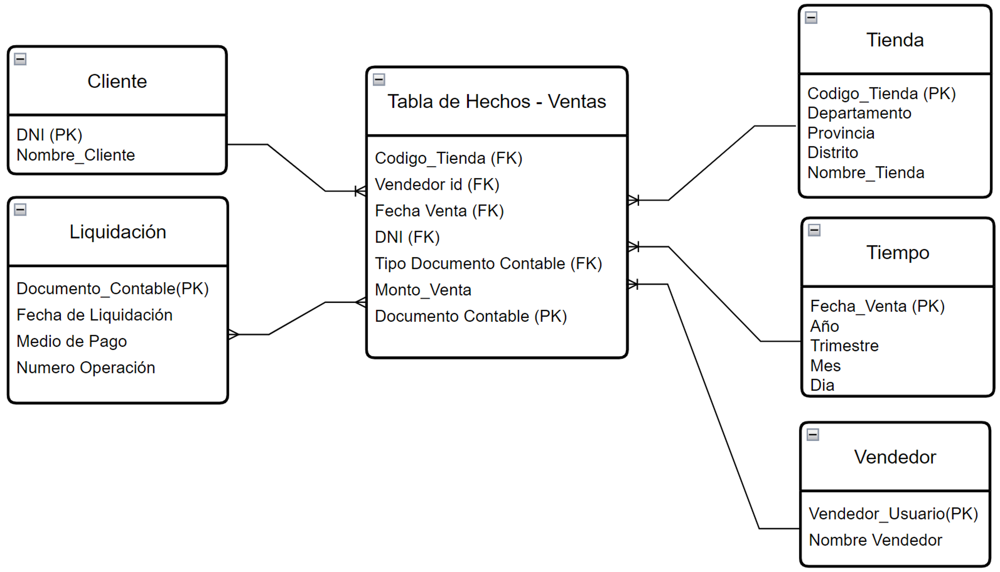

# Dashboard para el análisis de Demoras en el canal mostrador en el Area de Créditos y Cobranzas de Empresa Industrial (Datos Reales y Aleatoreos)

**Author**: Jean Mendoza Jara

**Email**: jean.mendoza.jara@gmail.com

**LinkedIn**: https://www.linkedin.com/in/jean-paul-mendoza-jara-8b53432b/

## Resumen del Proyecto

• Objetivo: 
Obtener información específica y certera sobre indicadores relevantes para el área. Identificar los motivos en las demoras y las áreas involucradas. Lograr una solución que sea aplicable a todas las tiendas a nivel nacional reduciendo los niveles de demora que afectan los tiempos de otras áreas, por ende en sus indicadores y métricas y objetivos. 

• Alcance:
El proyecto tiene alcance al área de ventas principalmente las jefaturas quienes tienen a cargo el despliegue de la información y políticas para la correcta ejecución de procesos. Asimismo, el área de Sistemas dando la información necesaria al área interesada en la mejora como la ubicación de las tablas y bases de datos pertinentes para la solución. Finalmente, el Área de Procesos y RRHH para recaudar información oficial de los procedimientos estandarizados para el personal de ventas y su medición.

• Indicadores y métricas relevantes a considerar en el proyecto son:
-El tiempo de demora en la facturación y el tiempo de demora en la liquidación serán los principales indicadores para el análisis de tiempos de demora. Por ende el tiempo de demora total viene a ser la suma de los 2 anteriores.

-Para tales efectos definiremos el tiempo de demora en facturación como la diferencia entre la fecha de pago y la fecha de venta (Que es cuando se emitió el documento contable) en días.

-Asimismo definiremos al tiempo de demora en liquidación a la diferencia entre la fecha de venta y la fecha de liquidación que es con la que finalmente Cobranzas utiliza la información ingresada en el punto de venta por las tiendas.

-Monto Total de Venta, para poder saber cual es el porcentaje de las ventas de cada tienda que esta pendiente de facturar, liquidar, compensar por parte de cobranzas y conciliar por el lado de contabilidad.

Paso 1 - Identificación de origen y fuentes de datos desde SQL Server 
Recopilación de datos: Identificar fuentes de datos. Las bases de datos de la empresa están en SQL Server por lo que se solicitó al administrador de las bases de datos la ubicación de las tablas, nomenclatura y accesos para poder integrar las tablas requeridas.

Paso 2 - ETL - Extracción, Transformación y Carga
Extracción de las bases de datos necesitadas para el desarrollo del proyecto. Las tablas provienen de diferentes bases de datos, por razones de seguridad sólo se compartirá el modelamiento mas no el origen ni ruta de las bases. Para la extracción, transformación y carga se usó Visual Studio SSIS Package .

Paso 3 - Creación de DATAMART (Cobranzas Canal Mostrador)
Se creó un DataMart con los datos extraídos de las BBDD de el área de TI en donde se declaró las llaves primarias y foraneas del modelo diseñado para el proyecto. 

Paso 4 - Deployment en SSAS (Visual Studio)
Para la utilización de las funcionalidades de SQL Analysis Server se realizó el Deployment de un Cubo ROLAP en Visual Studio SSAS.

Paso 5 - Creación de Dashboard (Power Bussines)

### Imagen 1 - Modelamiento Dimensional (Snowflake):

### Imagen 2 - Packete SSIS (Visual Studio)

### Imagen 3 - Packete SSAS (Visual Studio)

### Imagen 4 - Dashboard (Power Bi)

